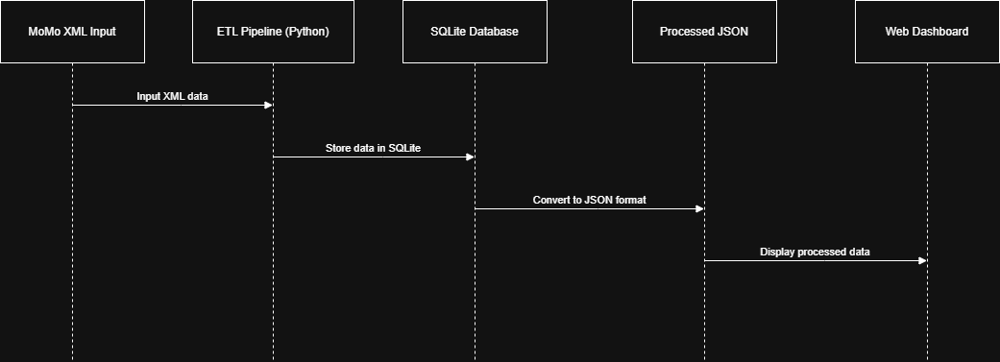

# MOMO-SMS-DATA-ANALYTICS-APP

## Project Description
A fullstack pipeline to parse MoMo SMS XML, clean and categorize transactions, store them in SQLite, and visualize analytics via a lightweight dashboard.

# Team Name: MoMo SMS Analytics Team

## Team Members
- Binthia Nitonde - GitHub Repository Setup & Backend Development
- Cedric Bigwi Hindura- System Architecture & Database Design  
- Cherish Yusuf - Scrum Master & Frontend Development

## Architecture


## Scrum Board
[(https://trello.com/invite/b/696362d52dfc3aa699034cce/ATTIe44c47408f5b74f9708de37808690e43B1EE2C98/group-9-momo-sms-data-dashboard-scrum-board)]

NOTE- We used TRELLO for our scrum board; to view the board, please log in with a free Trello account.

## Project Structure
```
├── web/              # Frontend dashboard
├── data/             # Data storage and logs
├── etl/              # ETL pipeline modules
├── api/              # API endpoints (optional)
├── scripts/          # Utility scripts
├── tests/            # Unit tests
└── docs/             # Documentation
```

## Setup
```bash
# Clone repository
git clone https://github.com/kenny260/MOMO-SMS-DATA-ANALYTICS-APP.git

# Install dependencies
pip install -r requirements.txt
```

## Technologies Used
- Python, SQLite, HTML/CSS/JavaScript
- ETL: lxml, dateutil
- API: FastAPI

---
*Week 1 - Team Setup and Planning*

Updated by Cherish Yusuf for Scrum board submission test.
